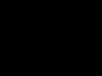
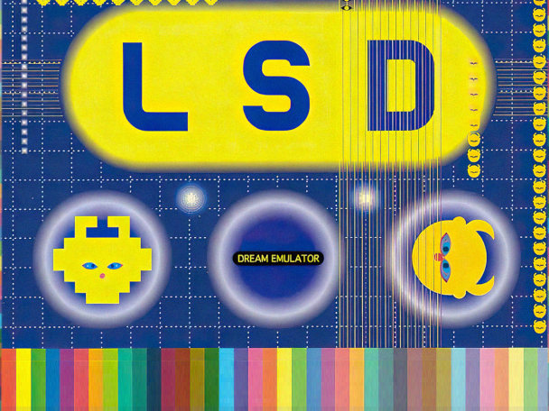
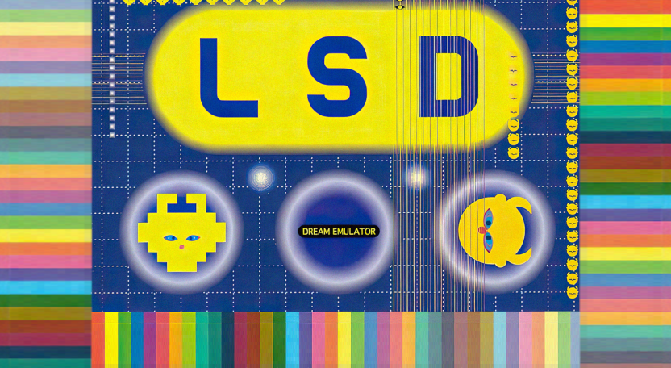

# LSD Dream Emulator Forwarder Channel

A Wii channel that boots straight into **LSD: Dream Emulator** through WiiStation.

## Screenshots

| 4:3 Icon | 4:3 Banner |
| ------------- | ------------- |
|  |  |

| 16:9 Icon | 16:9 Banner |
| ------------- | ------------- |
|  |  |

## Requirements

- **IOS58** — update to System Menu 4.3, or use the [IOS58 Installer](https://wiibrew.org/wiki/IOS58_Installer).
- **WiiStation, installed as a normal homebrew app and already working** — see below. This channel is a forwarder, not a self-contained emulator.
- **A PlayStation BIOS image**, dumped from your own console, with WiiStation configured to use it.
- **Your own dump of LSD: Dream Emulator**, as `LSD.bin` + `LSD.cue`.

| Title ID | Region | NAND Blocks |
|---|---|---|
| LSDE (000100014C534445) | Free | ~14 |

## Set up WiiStation first

**Do this before you install the channel, and make sure the game actually runs from it.** The channel does not configure anything — it hands WiiStation a directory and a filename and gets out of the way, so anything WiiStation needs has to already be in place.

1. Install **[WiiStation](https://github.com/xjsxjs197/WiiStationRX)** to `sd:/apps/` the normal way, so it appears in the Homebrew Channel.
2. Put your PS1 BIOS in `sd:/wiisxrx/bios/`. WiiStation probes for `SCPH1000/1001/1002.BIN` and `SCPH5500/5501/5502.BIN`.
3. Launch WiiStation and **select that BIOS in its Settings menu.** A fresh install has no settings file at all, so this is necessary.
4. Put your game in `sd:/wiisxrx/isos/` as `LSD.bin` and `LSD.cue`. The `.cue` is what gets listed, not the `.bin`.
5. **Boot the game from WiiStation itself and confirm it plays.** If it does not work here, it will not work from the channel either, and the channel gives you far less to go on when it fails.

Those settings live in `sd:/wiisxrx/`, which the channel shares.

## Install

> **Install BootMii and/or Priiloader first.** I took time to make sure that this `.wad` is safe — the icon sits at 53% of the System Menu's hard size cap and the banner at 57% of the memory budget, and every structural check in `build/tools/verify.py` passes — but one should always have protections in place in case of a banner brick.

1. Copy the contents of `SD/` to the root of your SD card, so that you end up with `sd:/apps/LSD_Dream_Emulator/` and `sd:/wiisxrx/`. This will not disturb an existing WiiStation install.
2. Install `LSD Dream Emulator - LSDE [cmyksoda].wad` with the WAD manager of your choice.

That's it. The channel looks for `sd:/apps/LSD_Dream_Emulator/boot.dol`, which the first step put there, and tells it to load the first file in `sd:/wiisxrx/isos/` whose name contains `LSD`, case-insensitively — so the game filename only has to *contain* it.

`SD/apps/LSD_Dream_Emulator/` is also a normal Homebrew Channel app in its own right — its `meta.xml` passes the same autoboot arguments, so launching it from HBC starts the game too.

### How it coexists with WiiStation

`SD/apps/LSD_Dream_Emulator/boot.dol` is a byte-identical copy of WiiStation 3.2's own `boot.dol` under a different folder name. It is a separate copy so that the channel keeps working if you move, rename or update your WiiStation install, and so that neither one can break the other. Both read the same `sd:/wiisxrx/` data folder, which is why the BIOS and settings you configured above carry straight over.

## Uninstall

Use the WAD manager you installed with, or delete the channel from the Wii system settings. Nothing outside the channel's own NAND title is touched.

## Troubleshooting

**Black screen after the channel loads.** Almost always the BIOS or the ROM. WiiStation's autoboot does not fail safe: with one entry or fewer in the ISO list it loads index 0 regardless, and if nothing matches `LSD` it loads the last entry instead. Press Reset — if WiiStation's own browser appears, the channel and forwarder are fine and the problem is the card contents or the BIOS setting.

**It works from WiiStation but not from the channel.** Check that `sd:/apps/LSD_Dream_Emulator/boot.dol` exists — that exact folder name, spelled exactly that way.

**The browser opens somewhere unexpected.** That is the tell that the forwarder passed the wrong directory. It should open in `sd:/wiisxrx/isos`.

## Credits

### The game

**LSD: Dream Emulator** (1998, PlayStation) — by **Osamu Sato**, published by **Asmik Ace Entertainment**. All game assets remain their property; nothing from the game ships in this repository except the screenshots and the ambient clip used for the channel art, and the game itself is not included.

*The English translation patch is by **Mr.Nobody & Arcanearia**, with text dreams based on translations by **Badcafe**, **Puptoon**, **Chia** and other collaborators from the LSD: Dream Emulator Wiki. It is not redistributed here — patch your own dump.*

### Emulator forwarded to

- [**WiiStation**](https://github.com/xjsxjs197/WiiStationRX) by **xjsxjs197**, forked from **WiiSXRX** by **NiuuS**
- **WiiSX/CubeSX**, a **PCSX** port — original team **emu_kidid** (general coding), **sepp256** (graphics and menu), **tehpola** (audio); later work by **matguitarist**, **Daxtsu**, **Mystro256**, **FIX94**, **NiuuS**, **xjsxjs197**, **saulfabregwiivc**, **Jokippo**

### Channel base

**FCE Ultra GX Channel** — donor for the banner archive, the NAND loader stub and the forwarder.

- **wilsoff**: coding
- **MrNick666**: artwork
- **Tantric**: forwarder and installer
- **svpe** and **megazig**: installer exploit

The banner and icon layouts are Tantric's, edited rather than rebuilt — every section the System Menu expects is still where it was. The forwarder is his DOL with four in-place patches (two splash PNGs, the app path, and the command line that carries the autoboot arguments). All of it is documented in [BUILDING.md](BUILDING.md).

### Graphics and sound

- Icon and banner art are my own composites of in-game screenshots and cover art.
- The banner sound is an ambient cue from the game itself.
- The forwarder splash screens are derived from the game's own artwork.

### Tools used

- **Benzin 2.1.12BETA** by **SquidMan (Alex Marshall)**, **comex** and **megazig**, © 2009 HACKERCHANNEL — `brlyt`/`brlan` XML round-trips
- **ImageMagick** — splash de-noising
- **devkitPPC** — `powerpc-eabi-objdump`, which is what made the forwarder reverse-engineering possible
- Everything else is in `build/tools/`: a from-scratch Python implementation of the WAD container, U8, LZ77, IMD5/IMET, TPL and a DSP ADPCM encoder, written because `libWiiSharp` is Windows-only. All of it was validated by byte-exact round-trip against the stock FCE Ultra GX WAD before being trusted.

## License

The parts of this repository that are mine — the build toolchain in `build/`, the channel art, and the documentation — are GPLv3, see [`LICENSE`](LICENSE).

This channel is built out of other people's GPL'd work, which stays under the licenses it came with:

- the forwarder, banner archive and icon are derived from [FCE Ultra GX](https://github.com/dborth/fceugx)
- the bundled `SD/apps/LSD_Dream_Emulator/boot.dol` is an unmodified copy of [WiiStation](https://github.com/xjsxjs197/WiiStationRX), itself descended from WiiSXRX and PCSX

Nothing here relicenses any of that. Every change made to the FCE Ultra GX components is documented in [BUILDING.md](BUILDING.md) — that file is the GPL modification record as much as it is a build guide, and it also covers rebuilding the WAD from the assets here.

Game assets are used for a non-commercial fan project and are not covered by any of the above; they remain the property of their owners.

## Repository contents

| path | |
|---|---|
| `LSD Dream Emulator - LSDE [cmyksoda].wad` | the channel — install this |
| `SD/` | copy to the root of your SD card |
| `icon/` | source PNGs for the icon layers, 176×96 |
| `banner/` | source PNG for the banner, 832×456 |
| `splash/` | forwarder loading screens — the 640×480 source, and the two de-noised PNGs actually embedded in the DOL |
| `audio/` | source WAV for the banner sound |
| `layout/` | `.brlyt`/`.brlan` extracted from the released WAD, plus their Benzin XML |
| `preview/` | the icon animation as GIFs, rendered from the real keyframes |
| `build/` | `build.sh` and the Python toolchain that rebuilds everything |
| `BUILDING.md` | how to rebuild, and what was changed in the GPL'd components |

The banner archive still carries 29 four-by-four stub textures named after Mario, Bowser, Princess and Toad. They are invisible, and they are there on purpose — every `txl1` entry and every `RLTP` reference in Tantric's animations has to still resolve.
